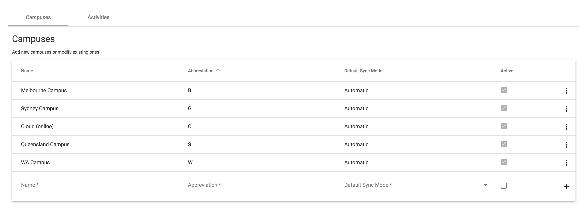
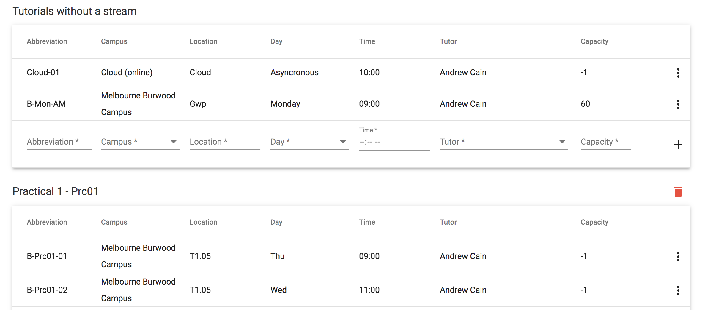
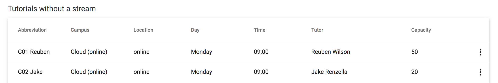
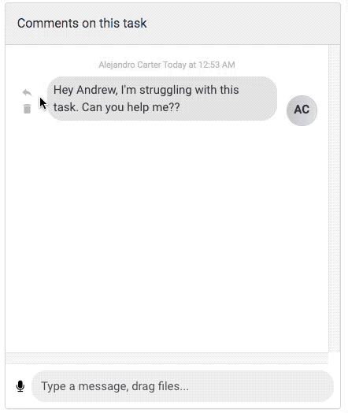

Welcome to the February 2020 update to Doubtfire. There are a number of significant feature enhancements in this release which we hope you will like. Some of the key highlights are:

* [Campus Support](#campus) - Tutorials and student enrolments are now linked with campuses.
* [Tutorial Streams](#streams) - Each unit now has tutorial streams, so you can have a Prac and a Seminar in the same unit for different student types.
* [Tutorial Capacity](#capacity) - Tutorials can optionally have a maximum capacity set.
* [Extension Changes](#extensions) - There is now a setting (on by default) that will automatically apply student extension requests that result in a due date that falls before the task's deadline. This is marked as approved by the main convenor.
* [Multiple Convenors](#convenors) - You can now indicate who is the main convenor for a unit. Communications from OnTrack will come from the main convenor in most cases.
* [Smart Syncing](#syncing) - Unit rollovers, system integrations means you can spend less time on admin tasks.
* [Reply Comments](#reply) - You can now reply to any individual task comment.

And if you want a peek under the hood...

* [Platform enhancements, Updates and Optimizations](#development) -- We have made changes to enable bundle optimisations in the load times of Doubtfire.

##  Campus Support
Campus support categorises students based on their campus location, or cloud. It supports mixed campus-based and online-based students, and can ensure students of one campus can not move into tutorials of another campus.

  </img>

##  Tutorials Streams
Tutorial streams allow you to support multiple tutorial types within a unit. For example, a unit like Introduction to Programming could have a practical, workshop and a tutorial all running for different student types. These are optional, so if a unit only has one type of tutorial then you can leave this setting unset. This feature is particularly useful for units with mixed campus and online cohorts.

  </img>

##  Tutorial Capacity
Tutorials can optionally have their capacity set, and will not allow students to transfer.

  </img>

##  Extension Changes
There is now a setting (on by default) that will automatically apply student extension requests that result in a due date that falls before the task's deadline. This is marked as approved by the main convenor.

##  Multiple Convenors
A unit can now have multiple convenors, with one convenor nominated as the main convenor. All emails will originate from the main convenor

##  Smart Syncing
Smart syncing supports deep integrations with your institution's settings to sync student enrolments, tutorials, locations etc.

##  Comment Replies
You can now reply to individual comments within a task panel, useful for when you are responding to a number of comments at once. Simple click the reply button next to a comment and start your response. You can respond to and with text, audio or image comments!

  </img>

##  Platform Updates and Optimisations
* The build process has been optimised, drastically improving load times for the app.
* Doubtfire is upgraded to Angular 9, enabling the IVY renderer for better performance.
* Full service-worker support for snappy loading times. (~2.1s -> ~0.6s on a fresh load after service worker registration.)