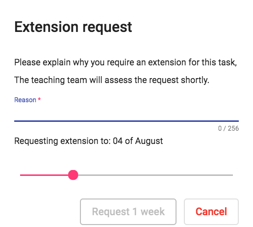
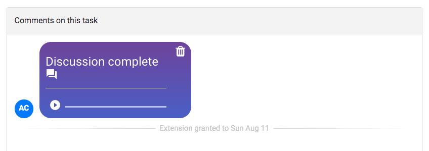
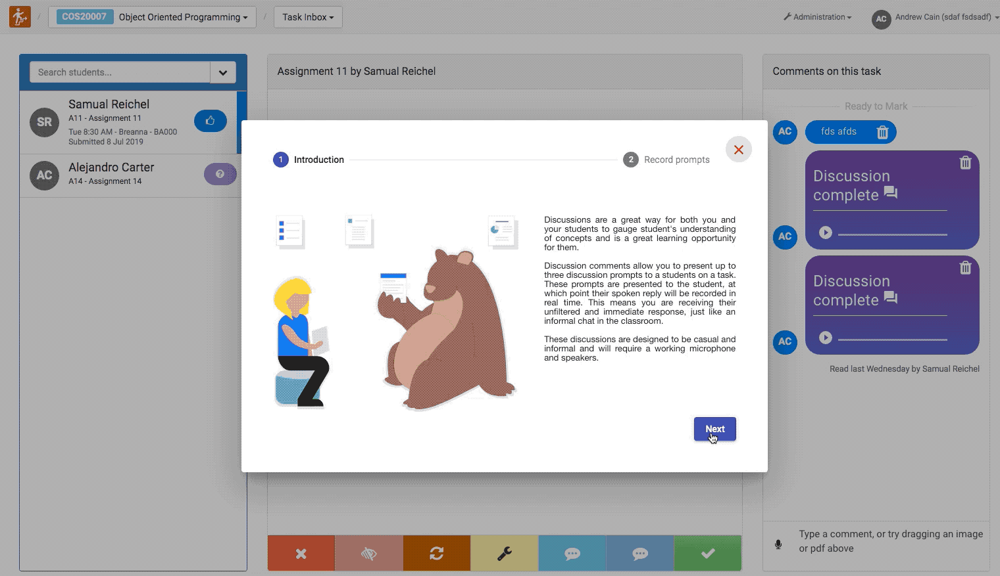
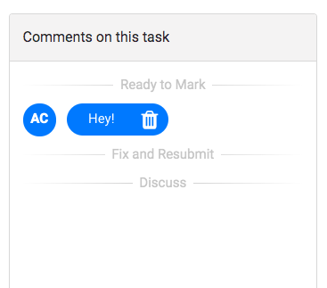

Welcome to the July 2019 update to Doubtfire. There are a number of significant feature enhancements in this release which we hope you will like. Some of the key highlights are:

* [Extensions Rework](#extensions) - Students can now request extensions per task, which are approved or denied by the tutor.
* [Discussions](#discussions) - Tutors can record and request Doubtfire to discuss a task with a student in real time, using the tutor's pre-recorded prompts.
* [Task Status History](#tsc) - Easily see the history of a task's progression over time.
* [Smart Task Order](#taskorder) - Smart ordering of tasks in the student task list.
* [Reworked Date Handling](#times) - All task-related dates such as due dates and deadlines are now the end of the day in the *Anywhere on earth* timezone.

And if you want a peek under the hood...

* [Platform Updates](#development) -- We are on our way to a full rewrite in modern angular and TypeScript, with this version deploying Angular 8.

##  Extensions
Previously, extension requests were automatically granted to students if the current date was before the task's deadline.
Now, extensions are requested by a student for a number of weeks. Students are only allowed to request extensions until the task's deadline.

Students are required to provide a short reason, and an approved extension duration which will be provided to the tutor.

Tutors will receive the request in their task inbox to assess as a comment on the task.

The history of requests and responses will be recoreded in the task comment panel, with the status (accepted/denied).

If a tutor denies an extension request, the submission will be placed on the <strong>Time Exceeded</strong> state, which means the submission will not arrive in the tutor's marking inbox.

##  Discussions
Intelligent Discussions are a new feature in Doubtfire designed to facilitate scalable, real-time student-tutor discussions.

Doubtfire allows tutors to record up to 3 discussion prompts. For example, you could ask "How did you go about solving step 1.3 in this task?", "What tools did you use?".

Doubtfire will create a special task comment using these prompts. When the student begins the discussion, Doubtfire will record audio while the prompt is being played in real-time.

Students will not have access to the prompts before their response is recorded, so you can feel confident you are receiving authentic responses.

Intelligent Discussions are designed to provide more support for <strong>discussion</strong>, not to replace assessment or student feedback.

The discussion feature will be improved over time with your help and feedback, and is the subject of a research project.

##  Task Status Comments
Task status change history will now be recorded in the task comment panel to better show the history of a task's progression at a glance.

##  Smart Task Order
We've reworked the way the student task list orders tasks. It no longer simply sorts by the start date/task level.

Tasks are now ordered based on the initial sequence, then by the due date and grade. As the teaching perioid progressed, Doubtfire will reorder tasks based off priority - so late Pass tasks come ahead of earlier Credit tasks. This is to ensure students complete pass tasks before spending time on `Credit`, `Distinction` or `High Distinction` tasks.

##  Date handling
Task due dates and deadlines are no longer 9am local time to the Doubtfire server. This could lead to confusion with time zones, daylight savings, and with deadlines being up to and/or on the hour.

Now, all due dates and deadlines are simply listed in Doubtfire as a day, for example `July 12`. The timezone of this day is set to the Anywhere on Earth Timezone, which is the moment which that day has passed in every time zone in the world. This means that in Melbourne, Australia students would realistically have a few hours into the 13th of July before the task is now past the due date/deadline.

##  Various Typescript/Angular platform upgrades
* Upgrade to angular 8.
* Adds stricter Typescript checking.
* Rewrite of the task comment panel in Angular and Typescript.
* Rewrite of the audio recording components, introduces inheritance so that audio recording components can be easily developed.

### Towards Angular
Over time, more and more angularJS Doubtfire components will be migrated to modern Angular. If you would like to contribute to the Open-Source Doubtfire Project, visit the [GitHub](https://github.com/doubtfire-lms/).