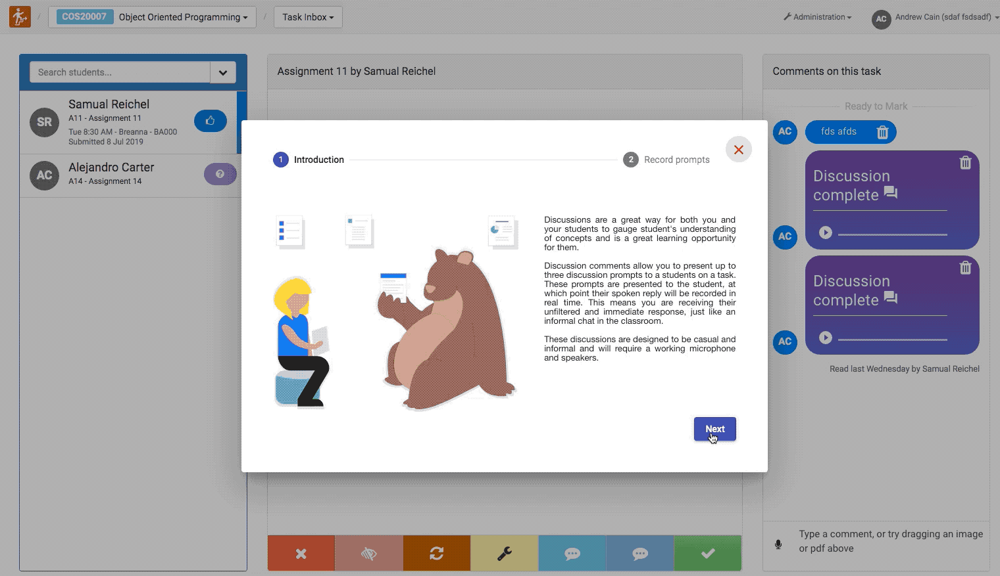

Intelligent Discussions are a new feature in Doubtfire designed to facilitate scalable, real-time student-tutor discussions.

Discussions are an important aspect of the student-teacher relationship. With our local students, we discuss how students felt about a task, what challenges they came across, and how they solved these challenges.

These discussions help us build a relationship with the student. We can begin to understand their thinking. This often leads to learning opportunities, and can even identify academic integrity issues such as plagiarism or contract cheating.

How can we have these discussions with our cloud students? One way which we currently try to do this is with audio comments, however, the problem is that the students can listen to your audio question, go off and consult or research an answer, and respond. This lacks the authenticity and the timeliness of an in-person discussion. We can try something like a Skype call, however, the time required to schedule the call, deal with time-zones or no-shows is prohibitive.

Doubtfire Discussion Comments are our solution to this problem. Doubtfire allows tutors to record up to 3 discussion prompts. For example, you could ask "How did you go about solving step 1.3 in this task?", "What tools did you use?", and "Can you explain how you came to this solution?".

Doubtfire will create a special task comment using these prompts. When the student begins the discussion, Doubtfire will record audio while the prompt is being played in real-time.

Students will not have access to the prompts before their response is recorded, so you can feel confident you are receiving authentic responses.

Intelligent Discussions are designed to provide more support for <strong>discussion</strong>, not to replace assessment or student feedback.

You can use the discussion comment feature starting today, by clicking the microphone button at the comment section, and selecting "Create Discussion", then following the steps.

The discussion feature will be improved over time with your help and feedback and is the subject of a research project.